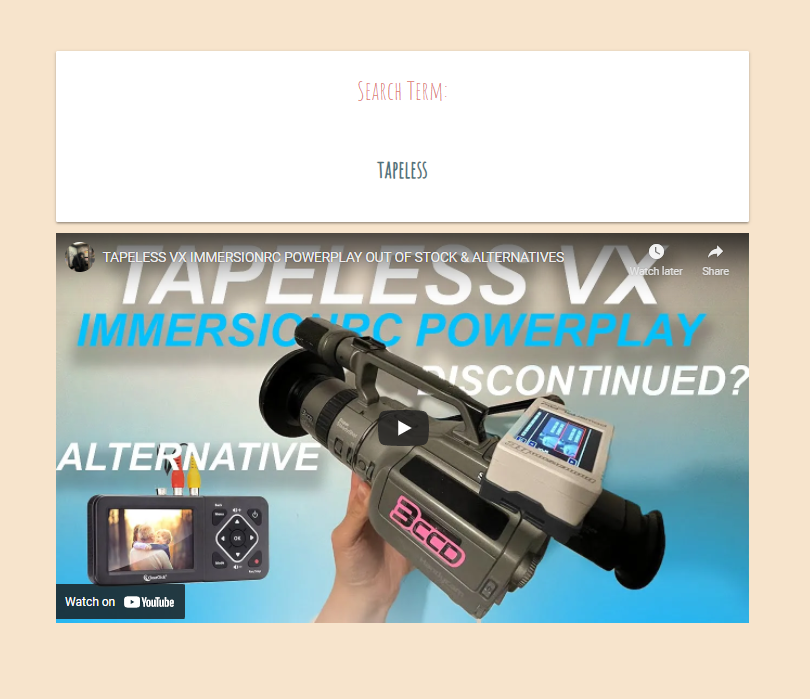

# **The BoringApp**

## Description

This project has for purpose to challenge our skills with the latest knowledge in Javascript, HTML and CSS using different server API's by creating a **real-world** front-end application with the idea to potentially showcase it to future employers.

## Objectives

```md
The main objective of this project is to create an application that could be related to our daily lives. And since 2 years our daily lives have been more online then ever. Which is factor of daily boredom. Thus the idea to help those people who are in need of a boredom cure.
The BoringApp team made an easy to understand application that will permit the user to cure boredom by entertaining them.
With the hope to give a productivity boost at the end of the break.
```

## Functionality

In order to prevent and control boredom during working breaks, we - Niko de Silva, Zahra Mammadli, Nabil Nasser and Olivier R.Measson - have been working on developing an interactive front-end application that has for purpose to "cure" your boredom.
The application permits for a user to "make a choice" between watching random videos using the **youtube API** or to learn something using the **bored API**.

This project permitted us to learn how to work as a team.
Using Github, we've been able to succesfully separate equally the tasks and maintain a proper workflow to achieve our goals.
We learned how to create different branches and how (and also when) to merge them.
We also learned how to apply different server-side API's in our application.

## Usage

```md
WHEN the user opens the BoringApp
THEN he is presented with the main page (inspired by Alice in Wonderland) where there is one button that will grab the attention and where he can access information such as: About us - Stats & Contacts
```


```md
WHEN the user clicks this button
THEN they will access to the next page where the user will face a choice between two pills: a blue pill and a red pill (inspired by the matrix)
```


```md
WHEN the user hovers his mouse over one of the pills
THEN text appears to inform the user about his choice possibility
```


```md
WHEN the user clicks on the BLUE pill
THEN the user will access a page with a randomly selected activity suggestion from the BoredAPI, and a localstorage item 'bluepills' is created or updated with the count of page visits. The user can decide to complete the activity in the real world, or alternatively watch someone else do it with a button click. This button returns the first YouTube search result for the BoredAPI activity string, as well as creating or updating a localstorage item 'redpills' which counts YouTube videos delivered.
```


```md
WHEN the user clicks on the RED pill
THEN she will stay in the matrix and be directed to a page where a randomly selected word (via a random word api: https://random-word-api.herokuapp.com) is plugged into the YouTube API and the first result is rendered on the screen. When the screen loads, a localstorage item 'redpills' is created or updated with a count of the number of screen loads.
```



```md
WHEN the user wants to know who the creators are
THEN he will find a "About Us" button in the navbar
WHEN the user access this page
THEN he will be presented with the following information
```


```md
WHEN the user wants to know what the global percentage of choice for the pills is
THEN she will find the "Statistics" button in the navbar
WHEN the user access this page
THEN she will find a graph with the necessary information (by retrieving stats from the local storage and building it with d3.js)
```


```md
WHEN the user wants to contact the creators
THEN he will find the "Contact US" button in the navbar
WHEN the user access this page
THEN he will be presented with a Contact Form and the email address of the creators
```


## Credits

```md
This work has been a collaboration between Niko de Silva, Zahra Mammadli, Nabil Nassar & Olivier R.Measson.
```

```md
With the tremendous help and support from Swapnil Gaikwad
```

# Links

## Github

- [Niko de Silva](https://github.com/queenmcsteve)
- [Zahra Mammadli](https://github.com/ZahraMammadli)
- [Nabil Nassar](https://github.com/nnassarv)
- [Olivier R.Measson](https://github.com/Zeitouna)

- [Swapnil Gaikwad](https://github.com/swapbcs)

## PRESENTATION

[Presentation of The Boring App](https://docs.google.com/presentation/d/1qJnQtA1RolKkoKrJHmYw-cxk2ub0IFlLcYKumZLcC40/edit?usp=sharing)

## DEMO

[TheBoringApp](https://zahramammadli.github.io/TheBoringApp/index.html)

Copyright 2021 Queen McSteve (contact via GitHub)

Permission is hereby granted, free of charge, to any person obtaining a copy of this software and associated documentation files (the "Software"), to deal in the Software without restriction, including without limitation the rights to use, copy, modify, merge, publish, distribute, sublicense, and/or sell copies of the Software, and to permit persons to whom the Software is furnished to do so, subject to the following conditions:

The above copyright notice and this permission notice shall be included in all copies or substantial portions of the Software.

THE SOFTWARE IS PROVIDED "AS IS", WITHOUT WARRANTY OF ANY KIND, EXPRESS OR IMPLIED, INCLUDING BUT NOT LIMITED TO THE WARRANTIES OF MERCHANTABILITY, FITNESS FOR A PARTICULAR PURPOSE AND NONINFRINGEMENT. IN NO EVENT SHALL THE AUTHORS OR COPYRIGHT HOLDERS BE LIABLE FOR ANY CLAIM, DAMAGES OR OTHER LIABILITY, WHETHER IN AN ACTION OF CONTRACT, TORT OR OTHERWISE, ARISING FROM, OUT OF OR IN CONNECTION WITH THE SOFTWARE OR THE USE OR OTHER DEALINGS IN THE SOFTWARE.
